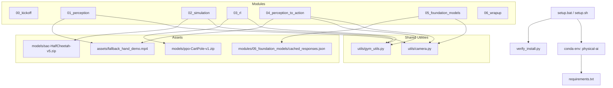

# Design Document: Physical AI Workshop Repository

## Overview

The Physical AI Workshop is a self-contained GitHub repository that runs a 3-hour, beginner-friendly session for approximately 30 participants on Windows 11 x86-64 laptops. Participants clone the repository, run a single setup script, and work through six guided modules that trace the complete Physical AI pipeline:

```
[Webcam] → [Perception Layer] → [State Vector] → [Sim Agent] → [Action]
    ↑                                                    ↑              ↓
[World/Sim] ←──────────────────────────────────────────────────── [Effect]
                                                         ↑
                                          [Foundation Model Reasoning]
```

The loop is closed: every action changes the simulated world, which changes what the camera sees next. This closed-loop property is what distinguishes Physical AI from static inference tasks.

### Design Principles

1. **Offline-first after setup** — every module must work with no internet access once the environment is installed. Pre-bundled model weights, fallback video, and cached API responses cover all external dependencies.
2. **Zero hardware requirements** — no GPU, no dedicated webcam required. Every hardware-dependent path has a software fallback that activates transparently.
3. **Single-command setup** — `setup.bat` handles conda env creation, pip installs, kernel registration, and verification. Participants run one command and attend the session.
4. **Beginner-scoped exercises** — each `exercise.py` contains all boilerplate; participants fill only small, well-delimited `# TODO START` / `# TODO END` blocks completable in 10–15 minutes.
5. **Transparent fallbacks** — when hardware or network fails, the system logs a clear warning and continues. Participants are never silently blocked.

### Repository Root Layout

```
physical-ai-workshop/
├── README.md
├── PRE_WORKSHOP_SETUP.md
├── LICENSE
├── setup.bat
├── setup.sh
├── verify_install.py
├── requirements.txt
├── environment.yml
├── .env.example
├── .gitignore
├── api/
│   └── server.py
├── frontend/
│   └── index.html
├── modules/
│   ├── 00_kickoff/
│   ├── 01_perception/
│   ├── 02_simulation/
│   ├── 03_rl/
│   ├── 04_perception_to_action/
│   ├── 05_foundation_models/
│   └── 06_wrapup/
├── utils/
│   ├── camera.py
│   └── gym_utils.py
├── models/
│   ├── ppo-CartPole-v1.zip
│   └── sac-HalfCheetah-v5.zip
├── assets/
│   ├── fallback_hand_demo.mp4
│   └── hand_landmarker.task
└── instructor/
    ├── FACILITATOR_GUIDE.md
    └── COMMON_ISSUES.md
```

The five workshop content directories (`modules/`, `utils/`, `models/`, `assets/`, `instructor/`) are those required by Requirement 1.3. The `api/` and `frontend/` directories are server/tooling directories explicitly exempted by Requirement 1.3.

---

## Architecture

### Component Dependency Graph



### Fallback Strategy Summary

| Dependency | Primary path | Fallback path | Error if fallback fails |
|---|---|---|---|
| Webcam | `cv2.VideoCapture(index)` | `assets/fallback_hand_demo.mp4` (looping) | `RuntimeError` |
| OpenGL rendering | `render_mode="human"` | `"rgb_array"` → `None` | `RuntimeError` after all three fail |
| Gemini API | live `google.genai` call | random entry from `cached_responses.json` | `sys.exit(1)` if cache missing |
| Pre-trained model | `models/*.zip` (committed) | n/a — committed to repo | `FileNotFoundError` from SB3 |
| Internet at setup | `pip install` from PyPI | n/a — participants run setup pre-session | Setup script error message + exit |
| HandLandmarker model | Downloaded to `assets/hand_landmarker.task` during setup | n/a — committed to repo | `FileNotFoundError` at Module 1/4 startup |

### Python Path Convention

All scripts use `Path(__file__).resolve().parent` to construct paths relative to their own location. This ensures scripts run correctly regardless of the working directory. Repository root is computed from a script's known depth:

```python
# In modules/01_perception/01_webcam_basics.py:
REPO_ROOT = Path(__file__).resolve().parents[2]  # two levels up from modules/01_perception/
```

---

## Components and Interfaces

### 2.1 `utils/camera.py`

#### `LoopingVideoCapture`

A thin wrapper class around `cv2.VideoCapture` that provides continuous frame delivery from a finite video file.

```python
class LoopingVideoCapture:
    """
    Drop-in replacement for cv2.VideoCapture that loops a video file indefinitely.
    Satisfies the same interface: read(), isOpened(), release().
    """
    def __init__(self, path: str) -> None: ...
    def read(self) -> tuple[bool, np.ndarray | None]: ...
    def isOpened(self) -> bool: ...
    def release(self) -> None: ...
```

**`read()` loop logic:**
1. Call `self._cap.read()` → `(ret, frame)`.
2. If `ret is True`: return `(True, frame)`.
3. If `ret is False` (EOF): seek to frame 0 via `self._cap.set(cv2.CAP_PROP_POS_FRAMES, 0)`, retry `self._cap.read()` once.
4. If retry also fails: return `(False, None)` (corrupt or empty file).

The wrapper exposes no additional methods beyond the three listed — all other `cv2.VideoCapture` calls (e.g. `get()`, `set()`) are not forwarded, keeping the interface minimal and testable.

#### `open_camera(index=0, fallback_path=None)`

```
open_camera(index: int = 0, fallback_path: str | None = None)
  → cv2.VideoCapture | LoopingVideoCapture

Raises:
  ValueError    — if fallback_path is explicitly supplied (not None) but is not a valid video source
  RuntimeError  — if the default fallback path cannot be opened
```

**Decision tree:**

```
1. Resolve fallback_path:
   IF fallback_path is None:
       fallback_path = str(Path(__file__).resolve().parent.parent / "assets" / "fallback_hand_demo.mp4")
   ELSE IF the resolved path is not openable as a video file:
       raise ValueError(f"fallback_path={fallback_path!r} is not a valid video source")
2. cap = cv2.VideoCapture(index)
3. If cap.isOpened(): return cap
4. Warn to stderr: f"Camera index {index} unavailable — using fallback video: {fallback_path}"
5. fallback_cap = cv2.VideoCapture(fallback_path)
6. If not fallback_cap.isOpened():
       raise RuntimeError("Neither webcam nor fallback video could be opened")
7. return LoopingVideoCapture(fallback_path)
```

**Design decision:** The `None` default means the function always finds the fallback asset regardless of working directory — critical because participants in VS Code frequently have their terminal open inside a module subdirectory. The `ValueError` for an invalid explicit `fallback_path` fires before trying the webcam (step 1), because if the caller explicitly overrides the fallback path, an invalid path is a programming error that should surface immediately. The `RuntimeError` for the default fallback is only reached if the default asset is missing from the repository.

**Import path note:** Module scripts import with `sys.path` manipulation:
```python
import sys
from pathlib import Path
sys.path.insert(0, str(Path(__file__).resolve().parents[2]))
from utils.camera import open_camera
```

---

### 2.2 `utils/gym_utils.py`

#### `make_env(env_id, render_mode="human")`

```
make_env(env_id: str, render_mode: str = "human") → gym.Env

Raises:
  RuntimeError  — if all three render modes fail with rendering-related exceptions
  (propagates)  — any non-rendering exception (e.g. unregistered env_id)
```

**Rendering exception detection:**

A rendering-related exception is identified by checking the exception type and message against known patterns:

```python
_RENDER_EXCEPTION_PATTERNS = (
    "opengl", "glfw", "display", "egl", "pyglet",
    "gl error", "render", "framebuffer", "glx",
)

def _is_render_error(exc: Exception) -> bool:
    msg = str(exc).lower()
    return (
        isinstance(exc, (ImportError, OSError, RuntimeError))
        and any(p in msg for p in _RENDER_EXCEPTION_PATTERNS)
    )
```

**Fallback chain:**

```
MODES = ["human", "rgb_array", None]

for mode in MODES:
    try:
        env = gym.make(env_id, render_mode=mode)
        if mode != requested_mode:
            print(f"[make_env] render_mode={requested_mode!r} failed — using {mode!r}")
        else:
            print(f"[make_env] Created {env_id!r} with render_mode={mode!r}")
        return env
    except Exception as e:
        if _is_render_error(e):
            print(f"[make_env] render_mode={mode!r} failed: {e}")
            continue
        raise  # non-rendering exception: propagate immediately

raise RuntimeError(f"make_env: all render modes failed for {env_id!r}")
```

**Design decision:** The fallback chain only iterates past modes that fail with rendering-related exceptions. Any other exception (unknown `env_id`, version mismatch, etc.) propagates immediately without consuming the remaining fallback slots. This avoids masking programming errors as rendering failures.

#### `LivePlotCallback`

```python
class LivePlotCallback(BaseCallback):
    """
    Matplotlib live reward plot updated every check_freq training steps.
    Falls back to file output (Agg backend) when a display is unavailable.
    """
    def __init__(self, check_freq: int = 1000, save_path: str | None = None): ...
    def _on_step(self) -> bool: ...
    def _on_training_end(self) -> None: ...
```

**Display detection:** At `__init__` time, attempt `matplotlib.pyplot.ion()` inside a try/except. If it raises (headless environment), switch to `matplotlib.use("Agg")` and set `self._file_mode = True`. In file mode, the plot is saved to `save_path` (defaulting to `models/training_curve.png`) every `check_freq` steps instead of being displayed interactively.

**Non-blocking update:** Uses `plt.pause(0.001)` after each `fig.canvas.draw()` call to yield to the matplotlib event loop without blocking the training thread. On Agg backend, `plt.pause()` is a no-op, so the training loop runs at full speed.

**Data tracked:** Episode reward (from `self.model.ep_info_buffer`) and a running mean over the last 100 episodes.

---

#### `StreamingCallback`

```python
class StreamingCallback(BaseCallback):
    """
    SB3 callback that pushes training progress events to a queue.Queue
    for consumption by the FastAPI SSE training progress endpoint.
    """
    def __init__(self, job_queue: queue.Queue, check_freq: int = 1000, model_save_path: str = "models/ppo-CartPole-trained.zip"): ...
    def _on_step(self) -> bool: ...
    def _on_training_end(self) -> None: ...
```

**`_on_step` logic:** Every `check_freq` steps, compute the mean reward from `self.model.ep_info_buffer` (last 100 episodes). If the buffer is non-empty, put `{"timestep": self.num_timesteps, "mean_reward": float(mean_reward)}` onto `self.job_queue`. Return `True` to continue training.

**`_on_training_end` logic:** Save the model to `model_save_path` via `self.model.save(model_save_path)`. Put `{"done": True, "model_path": model_save_path}` onto `self.job_queue`.

**Queue lifecycle:** The queue is created by `POST /api/training/start` before spawning the thread, stored in `_jobs[job_id]`, and consumed by `GET /api/training/progress/{job_id}`. The SSE endpoint reads items with `queue.get(timeout=30)` — a timeout of 30 seconds between events triggers an SSE `"heartbeat"` event to keep the connection alive.

**Thread safety:** `queue.Queue` is thread-safe. No locks are needed. The training thread only puts items; the SSE handler only gets items.

---

### 2.3 `verify_install.py`

Standalone script, no project imports. Must complete in ≤30 seconds.

**Package check table:**

| Import name | pip install target |
|---|---|
| `numpy` | `numpy` |
| `mujoco` | `mujoco` |
| `gymnasium` | `gymnasium` |
| `stable_baselines3` | `stable-baselines3` |
| `cv2` | `opencv-python` |
| `mediapipe` | `mediapipe` |
| `cvzone` | `cvzone` |
| `google.genai` | `google-genai` |
| `torch` | `torch` |
| `PIL` | `Pillow` |
| `matplotlib` | `matplotlib` |
| `huggingface_hub` | `huggingface_hub` |

**Check flow:**

```
passed = 0
failed = 0
warns = 0

for (import_name, pip_name) in PACKAGES:
    try:
        importlib.import_module(import_name)
        print(f"[PASS] {import_name}")
        passed += 1
    except ImportError:
        print(f"[FAIL] {import_name}")
        print(f"       → pip install {pip_name}")
        failed += 1

# Webcam check (check 13/14):
cap = cv2.VideoCapture(0)
if cap.isOpened():
    ret, _ = cap.read()
    cap.release()
    if ret:
        print("[PASS] camera")
        passed += 1
    else:
        print("[WARN] Camera unavailable — fallback video will be used")
        warns += 1
else:
    cap.release()
    print("[WARN] Camera unavailable — fallback video will be used")
    warns += 1

# CartPole env check (check 14/14) — uses make_env to test the actual render fallback chain:
try:
    import sys
    from pathlib import Path
    sys.path.insert(0, str(Path(__file__).resolve().parent))
    from utils.gym_utils import make_env
    env, _ = make_env("CartPole-v1", render_mode="rgb_array"), None
    # make_env returns env; unpack if it returns a tuple, else use directly
    if isinstance(env, tuple):
        env = env[0]
    env.reset()
    env.step(env.action_space.sample())
    env.close()
    print("[PASS] gymnasium CartPole-v1")
    passed += 1
except Exception as e:
    if any(p in str(e).lower() for p in ("opengl", "display", "egl", "glfw", "render")):
        print("[WARN] OpenGL unavailable — headless rendering will be used")
        warns += 1
    else:
        print(f"[FAIL] gymnasium CartPole-v1: {e}")
        failed += 1

warn_msg = f" ({warns} warnings — fallbacks active)" if warns > 0 else ""
print(f"\nSetup complete: {passed}/14 checks passed{warn_msg}")
sys.exit(0 if failed == 0 else 1)
```

**Webcam display window:** The verification script shows a live camera window for at most 2 seconds (using a `time.time()` deadline) or until the user presses `q`. This is separate from the pass/fail check above — the window is for visual confirmation only and does not affect the exit code.

**Note on CartPole check:** Using `make_env` rather than `gym.make` directly ensures the verify script tests the same code path participants will actually execute, including the render fallback chain.

---

### 2.4 `setup.bat` (Windows)

**Full execution order:**

```
1.  Check conda is on PATH (where conda)
2.  conda create -n physical-ai python=3.12 -y --no-default-packages
    → On timeout (120s): print solver hint, exit /b 1
    → On non-zero exit: print solver hint, exit /b 1
3.  Activate the environment using the robust batch activation pattern:
    call "%USERPROFILE%\miniconda3\Scripts\activate.bat" physical-ai 2>nul
    IF %ERRORLEVEL% NEQ 0 (
        call "%USERPROFILE%\anaconda3\Scripts\activate.bat" physical-ai 2>nul
    )
    IF %ERRORLEVEL% NEQ 0 (
        call conda activate physical-ai
    )
    Verify activation by checking: python --version | findstr "3.12"
    IF no match: print "Environment activation failed — run 'conda init cmd.exe' and restart terminal", exit /b 1

    Note: The direct `Scripts\activate.bat` path works without `conda init` and is the most reliable method on Windows. The fallback to `conda activate` handles edge cases where the Scripts path differs.
4.  pip install torch==2.14.0+cpu --index-url https://download.pytorch.org/whl/cpu
    → On non-zero exit: print internet error message, exit /b 1
5.  pip install -r requirements.txt
    → On non-zero exit: print internet error message, exit /b 1
6.  python -m ipykernel install --user --name physical-ai --display-name "Physical AI Workshop"
7.  python verify_install.py
    → On non-zero exit: echo "Setup completed with warnings — see output above"
    (does NOT exit /b 1 — warnings are not fatal)
8.  echo "Done! Open VS Code and select the 'Physical AI Workshop' kernel."
```

**Timeout implementation note:** Windows batch does not have a native subprocess timeout primitive. The 120-second conda timeout (Req 2.7) is implemented using `start /b conda create ...` combined with a polling loop and `taskkill`. The exact implementation:

```bat
start /b "" conda create -n physical-ai python=3.12 -y --no-default-packages > conda_log.txt 2>&1
set /a elapsed=0
:wait_loop
timeout /t 5 /nobreak > nul
set /a elapsed+=5
findstr /c:"done" conda_log.txt > nul 2>&1 && goto :conda_done
findstr /c:"error" conda_log.txt > nul 2>&1 && goto :conda_error
if %elapsed% GEQ 120 goto :conda_timeout
goto :wait_loop
```

This approach is best-effort — conda log output format varies across versions. The comment in the script explains the limitation and recommends the libmamba workaround.

---

### 2.5 `setup.sh` (Mac/Linux)

Mirrors `setup.bat` using POSIX shell:
- `conda create` and `conda activate` via `. "$(conda info --base)/etc/profile.d/conda.sh"`
- Same install sequence (PyTorch CPU first, then `requirements.txt`)
- Kernel registration and verify script
- Error handling with `|| { echo "..."; exit 1; }`
- Timeout: `timeout 120 conda create ...` (GNU coreutils `timeout` command)

---

### 2.6 `requirements.txt`

```
# Workshop Python dependencies
# Install AFTER: pip install torch==2.14.0+cpu --index-url https://download.pytorch.org/whl/cpu

numpy==2.2.4
mujoco>=3.1,<4.0
gymnasium[classic_control,mujoco]==1.3.0
stable-baselines3==2.9.0
opencv-python==4.13.0.92
mediapipe==1.0.0
cvzone
google-genai
huggingface_hub
huggingface_sb3
Pillow
matplotlib
ipykernel
imageio[ffmpeg]
python-dotenv
```

**MediaPipe Tasks API:** This workshop uses `mediapipe.tasks.vision.HandLandmarker` (MediaPipe v1.0.0, released April 2026 — the first stable major release of the Tasks API). `mediapipe==1.0.0` is pinned. `cvzone` is kept **for drawing utilities only** and is unpinned.

---

### 2.7 Module Interfaces

Each module directory follows the same structure contract:

```
modules/<NN>_<name>/
├── 01_<topic>.py      # or .ipynb
├── 02_<topic>.py      # (if applicable)
├── 03_<topic>.py      # (if applicable)
└── exercise.py
```

All demonstration scripts (`01_*`, `02_*`, `03_*`) are standalone — they can be run with `python modules/NN_name/script.py` from the repo root or with the correct kernel in Jupyter/VS Code. They do not import from each other; only from `utils/`.

> **Module 4 pedagogical note:** Module 4 intentionally bridges Module 3 (RL) and the wrap-up: the teleoperation pattern used here is exactly how demonstration data is collected for imitation learning (Behaviour Cloning, ACT, Diffusion Policy). This connection is made explicit in the exercise prompt and in Module 6.

---

### 2.8 Module 5 — `cached_responses.json` Structure

Per Requirement 6.5, the cache uses a keyed structure for deterministic lookup:

```json
{
  "describe the scene in one sentence": "A desk with a laptop, some books, and a coffee mug in natural lighting.",
  "you are a robot controller...action suggestion": {"action": "WAIT", "reason": "Scene is clear, no objects detected"},
  "you are a robot controller...LEFT": {"action": "LEFT", "reason": "Object appears on the right side of the frame"},
  "you are a robot controller...RIGHT": {"action": "RIGHT", "reason": "Object appears on the left side of the frame"},
  "you are a robot controller...FORWARD": {"action": "FORWARD", "reason": "Path ahead appears clear"},
  "you are a robot controller...BACK": {"action": "BACK", "reason": "Obstacle detected in forward direction"},
  "describe objects": "Several everyday objects are visible on a flat surface.",
  "what gesture": "The hand appears to be making a pointing gesture with the index finger extended.",
  "joint angles": "The hand shows extended fingers with moderate joint angles across all digits.",
  "robot action from image": {"action": "WAIT", "reason": "Insufficient scene context to determine action"}
}
```

**Key normalisation:** Before lookup, normalise the prompt by lowercasing, stripping leading/trailing whitespace, and collapsing internal whitespace runs to a single space. If no exact key matches, fall back to `random.choice(list(cache.values()))`.

**Load helper (used by both Module 5 scripts):**

```python
def load_cache(path: Path | None = None) -> dict:
    """
    Load cached_responses.json. Returns the dict.
    Raises SystemExit(1) if the file is absent or contains no valid entries.
    """
    if path is None:
        path = Path(__file__).resolve().parent / "cached_responses.json"
    if not path.exists():
        print(f"ERROR: Cache file not found: {path}", file=sys.stderr)
        sys.exit(1)
    with path.open() as f:
        data = json.load(f)
    if not data:
        print("ERROR: cached_responses.json contains no valid entries.", file=sys.stderr)
        sys.exit(1)
    return data
```

---

## Data Models

### 4.1 State Vector

The Physical AI pipeline's central data structure is the **state vector** — a 1D `numpy.ndarray` of `float32` values encoding the observable state at one timestep.

| Module | State vector contents | Typical shape |
|---|---|---|
| Module 1 (perception) | Joint angles [θ_thumb, θ_index, θ_middle, θ_ring] in degrees | `(4,)` |
| Module 2 (CartPole) | [cart_pos, cart_vel, pole_angle, pole_vel] | `(4,)` |
| Module 2 (Reacher-v5) | [cos θ0, sin θ0, cos θ1, sin θ1, target_x, target_y, angular_vel0, angular_vel1, fingertip_x, fingertip_y, dist] | `(11,)` |
| Module 4 (hand-to-reacher) | action = [joint0_torque, joint1_torque] derived from landmark 8 (values in [-1,1] map to applied torque magnitude and direction) | `(2,)` |

### 4.2 Landmark Data (MediaPipe Tasks API)

`mediapipe.tasks.vision.HandLandmarker` is configured with `LIVE_STREAM` mode for real-time webcam processing. Results are delivered via an async callback.

```python
import mediapipe as mp
from mediapipe.tasks import python as mp_python
from mediapipe.tasks.python import vision as mp_vision

# Model path (downloaded during setup):
MODEL_PATH = str(REPO_ROOT / "assets" / "hand_landmarker.task")

base_options = mp_python.BaseOptions(model_asset_path=MODEL_PATH)
options = mp_vision.HandLandmarkerOptions(
    base_options=base_options,
    running_mode=mp_vision.RunningMode.LIVE_STREAM,
    num_hands=2,
    result_callback=on_result   # async callback receives results
)
landmarker = mp_vision.HandLandmarker.create_from_options(options)
```

**Result structure** (received in the callback):
```python
def on_result(result: mp.tasks.vision.HandLandmarkerResult, ...):
    # result.hand_landmarks: list of hands, each hand is a list of 21 NormalizedLandmark
    # NormalizedLandmark has .x, .y, .z attributes (all in [0.0, 1.0] range for x,y)
    for hand_landmarks in result.hand_landmarks:
        lm8 = hand_landmarks[8]  # index finger tip
        norm_x, norm_y = lm8.x, lm8.y
```

**Key differences from legacy API:**
- Coordinates are already normalised to [0,1] — no pixel division needed
- Results come via callback, not synchronous return — use a `threading.Event` or `queue.Queue` to pass results to the main loop
- Drawing is done with `mp.solutions.drawing_utils` (still available) or OpenCV directly

**Model file download (added to setup):**
The HandLandmarker requires a `.task` model bundle. Add to `setup.bat`:
```bat
python -c "import urllib.request; urllib.request.urlretrieve('https://storage.googleapis.com/mediapipe-models/hand_landmarker/hand_landmarker/float16/latest/hand_landmarker.task', 'assets/hand_landmarker.task')"
```
This is a ~8MB download, done once during setup. Alternatively, commit the file to the repository like the pretrained model weights.

For Module 4's action mapping, only `hand_landmarks[0][8]` (index finger tip) is used. The coordinates are already normalised to `[0, 1]` by the Tasks API — no pixel division required.

**Normalisation:**
```python
# HandLandmarker result — landmark coordinates are already normalised to [0,1]
lm8 = hand_landmarker_result.hand_landmarks[0][8]  # index finger tip
norm_x = lm8.x   # already in [0.0, 1.0]
norm_y = lm8.y   # already in [0.0, 1.0]
```
Note: Unlike the legacy solutions API, no pixel-to-normalised division is needed — the Tasks API returns normalised coordinates directly.

### 4.3 Gemini API Request/Response

**Request structure (google-genai SDK):**

```python
from google import genai
from google.genai import types

# Text-only request (Module 5, script 1):
response = client.models.generate_content(
    model="gemini-2.5-flash",
    contents=["Describe this scene in one sentence:", pil_image_object]
)

# Image + structured prompt (Module 5, script 2):
image_part = types.Part.from_bytes(
    data=jpg_bytes,
    mime_type="image/jpeg"
)
response = client.models.generate_content(
    model="gemini-2.5-flash",
    contents=[SYSTEM_PROMPT, image_part]
)
```

**Design decision:** Use `types.Part.from_bytes()` rather than a raw dict `{"mime_type": ..., "data": ...}`. The raw dict form is not documented in the `google-genai` SDK and may silently fail or raise a type error at runtime. `types.Part.from_bytes()` is the canonical pattern in the [Google Gemini cookbook](https://github.com/google-gemini/cookbook) (Apache-2.0).

**Expected response shape (Module 5, script 2):**

```json
{"action": "LEFT|RIGHT|FORWARD|BACK|WAIT", "reason": "one sentence explanation"}
```

The response is parsed with `json.loads(response.text)`. If `response.text` contains markdown fences (e.g. `` ```json ... ``` ``), strip them before parsing:

```python
text = response.text.strip()
if text.startswith("```"):
    text = text.split("```")[1]
    if text.startswith("json"):
        text = text[4:]
result = json.loads(text.strip())
```

### 4.4 Pre-trained Model Files

| File | Source | Expected size | Load command |
|---|---|---|---|
| `models/sac-HalfCheetah-v5.zip` | `huggingface_sb3.load_from_hub("sb3/sac-HalfCheetah-v5", ...)` | ~200 KB | `SAC.load(path)` |
| `models/ppo-CartPole-v1.zip` | `huggingface_sb3.load_from_hub("sb3/ppo-CartPole-v1", ...)` | ~100 KB | `PPO.load(path)` |

> **Note:** Load HalfCheetah with `from stable_baselines3 import SAC` not PPO. HalfCheetah uses SAC (Soft Actor-Critic) for continuous action spaces.

Both files are committed to the repository directly (no Git LFS — well under the 100 MB GitHub limit). They are downloaded once by the repository maintainer using the `huggingface_sb3` helper and committed.

### 4.5 Exercise Scaffolding Schema

Every `exercise.py` follows a consistent code structure:

```python
#!/usr/bin/env python3
"""
Module N Exercise: <title>
Expected output: <description of what correct output looks like>
"""

# --- Standard imports (all provided, no TODOs here) ---
import numpy as np
# ... other imports ...

# --- Helper functions (fully implemented) ---
def helper_function(...):
    ...

# --- Main exercise code ---
def main():
    # Fully implemented setup code ...

    # TODO START — Add <specific task description> here
    raise NotImplementedError(
        "Implement <function name> at line <N>. "
        "See # EXPECTED OUTPUT comment below."
    )
    # TODO END
    # SOLUTION HINT: <one or more sentences describing the approach, no code>

    # EXPECTED OUTPUT: <label identifying the expected artifact>
    # ... rest of the script ...

if __name__ == "__main__":
    main()

# ==============================================================================
# SOLUTION (uncomment to run):
# ==============================================================================
# def main():
#     ... complete solution ...
```

**Invariants enforced across all exercise files:**
- Only one contiguous `# TODO START` / `# TODO END` block per exercise (keeps scope small).
- The `NotImplementedError` message names the function and line number.
- The `# SOLUTION HINT` comment is plain English with no executable expressions.
- The `# SOLUTION` block at the bottom is fully commented (`#` on every line).

---

## Correctness Properties

*A property is a characteristic or behavior that should hold true across all valid executions of a system — essentially, a formal statement about what the system should do. Properties serve as the bridge between human-readable specifications and machine-verifiable correctness guarantees.*

The following properties cover the pure-function and algorithmic components of the repository. UI scripts, notebooks, and I/O-heavy modules (camera display loops, training runs, API calls) are tested with example-based and integration tests instead (see Testing Strategy).

### Property 1: Fallback camera always produces readable frames

*For any* invalid webcam index, `open_camera(index=invalid_index, fallback_path=valid_video)` should return a capture object where calling `read()` any number of times always returns `(True, frame)` with `frame` being a non-empty NumPy array.

**Validates: Requirements 7.1, 7.2, 7.3**

### Property 2: LoopingVideoCapture reads continuously past end of file

*For any* valid video file of length N frames, a `LoopingVideoCapture` wrapping it should return valid `(True, frame)` tuples on the (N+1)th read and all subsequent reads — the stream never terminates.

**Validates: Requirements 7.3**

### Property 3: open_camera raises ValueError for any invalid explicit fallback_path

*For any* string that does not resolve to a readable video file, calling `open_camera(fallback_path=that_string)` should raise `ValueError` with a message containing the supplied path.

**Validates: Requirements 7.4**

### Property 4: make_env render fallback chain exhausts all modes before raising

*For any* valid `env_id`, if `gym.make` raises a rendering-related exception for `render_mode="human"` and `render_mode="rgb_array"` but succeeds with `render_mode=None`, then `make_env(env_id)` should return a valid environment without raising an exception.

More generally: *for any* prefix of the ordered mode list `["human", "rgb_array", None]` that all raise rendering exceptions, `make_env` should continue to the next mode and succeed on the first non-failing mode.

**Validates: Requirements 8.2, 8.3, 8.4, 8.5, 8.6**

### Property 5: Non-rendering exceptions propagate without retry

*For any* exception raised by `gym.make` that is not a rendering-related exception (e.g. `ValueError: unknown env_id`), `make_env` should re-raise that exact exception and `gym.make` should have been called exactly once.

**Validates: Requirements 8.7**

### Property 6: scale_landmark_to_action is a correct linear map

*For any* normalised landmark coordinate `x` in `[0.0, 1.0]`, the function `scale_landmark_to_action(x)` should return `2.0 * x - 1.0`, mapping the range `[0, 1]` to `[-1, 1]` with no clipping, rounding, or domain error.

**Validates: Requirements 13.2**

### Property 7: verify_install summary count matches actual pass count

*For any* combination of check outcomes across the 14 checks, the integer N in the output line `"Setup complete: N/14 checks passed"` should equal the exact count of checks that produced neither a `[FAIL]` nor a `[WARN]` result.

**Validates: Requirements 5.5**

### Property 8: Gemini fallback always returns a parseable action dict

*For any* exception type raised by the Gemini API call (network error, auth error, timeout, malformed JSON response), `02_gemini_robot_brain.py` should produce a dict with at least the key `"action"` — either from a successful parse or from the cache fallback — and never exit with an unhandled exception.

**Validates: Requirements 14.5**

---

## Error Handling

### Camera Errors

| Situation | Behaviour | Req |
|---|---|---|
| Webcam index unavailable | Warn to stderr, open fallback video | 7.2 |
| Fallback video loops | `LoopingVideoCapture` resets on EOF | 7.3 |
| Explicit `fallback_path` invalid | `ValueError` immediately | 7.4 |
| Both webcam and default fallback unavailable | `RuntimeError` | 7.5 |
| Module 4 neither source openable | Print error, `sys.exit(1)` | 13.1 |

### Rendering Errors

| Situation | Behaviour | Req |
|---|---|---|
| `render_mode="human"` raises render exception | Log, retry with `"rgb_array"` | 8.3 |
| `render_mode="rgb_array"` raises render exception | Log, retry with `None` | 8.4 |
| All three modes fail | `RuntimeError` | 8.6 |
| Non-rendering exception (bad `env_id`) | Propagate immediately | 8.7 |
| Module 4 render unavailable | Display numeric readout instead of render frame | 13.5 |

### Gemini API Errors

| Situation | Behaviour | Req |
|---|---|---|
| `GEMINI_API_KEY` absent/empty | Warn to stdout, use random cache entry | 14.2 |
| API raises any exception | Log to stderr, use random cache entry | 14.5 |
| Response not valid JSON | `json.JSONDecodeError` caught, use random cache entry | 14.5 |
| `cached_responses.json` missing or empty | Log to stderr, `sys.exit(1)` | 14.8 |

### Setup Script Errors

| Situation | Behaviour | Req |
|---|---|---|
| `conda` not on PATH | Print install instructions, `exit /b 1` | 2.1 |
| `conda create` slow (>120s) | Print libmamba hint, `exit /b 1` | 2.7 |
| Any `pip install` fails | Print internet check message, `exit /b 1` | 2.8 |
| `verify_install.py` exits non-zero | Print warning (not fatal to setup) | 2.6 |

### Exercise Error Handling

Unmodified `exercise.py` files raise `NotImplementedError` with a descriptive message identifying the function name and line number. This ensures participants receive clear guidance rather than a confusing traceback.

---

## Testing Strategy

### Overview

This repository contains workshop content, not a production application. The testing strategy is pragmatic: focus automated tests on the shared utility code that participants will encounter through every module, and use manual/integration testing for the module scripts and notebooks.

The testing stack uses **pytest** for unit and example-based tests and **hypothesis** for property-based tests. Both are development dependencies, not in `requirements.txt`.

### Unit Tests (pytest, example-based)

Located in `tests/` at the repository root (a `tests/` directory is a standard tooling directory exempt from Req 1.3's five-directory constraint).

**`tests/test_camera.py`**:
- `test_open_camera_returns_valid_cap` — mock `cv2.VideoCapture` to simulate `isOpened()=True`, verify return type.
- `test_open_camera_fallback_on_invalid_index` — mock `isOpened()=False`, verify `LoopingVideoCapture` is returned.
- `test_open_camera_raises_runtime_if_fallback_missing` — mock both VideoCapture and fallback as failing, verify `RuntimeError`.
- `test_open_camera_raises_value_error_for_explicit_bad_path` — pass a non-existent path as `fallback_path`, verify `ValueError`.
- `test_looping_video_capture_resets_on_eof` — use a known short test video (3 frames), read 6 frames, verify all succeed.

**`tests/test_gym_utils.py`**:
- `test_make_env_human_mode_succeeds` — mock `gym.make` to succeed on first call, verify env returned.
- `test_make_env_falls_back_to_rgb_array` — mock `gym.make` to raise render error on "human", succeed on "rgb_array".
- `test_make_env_falls_back_to_none` — mock to raise render error on "human" and "rgb_array", succeed on `None`.
- `test_make_env_raises_runtime_when_all_fail` — mock all three to raise render errors, verify `RuntimeError`.
- `test_make_env_propagates_non_render_exception` — mock `gym.make` to raise `ValueError("No registered env")`, verify propagated and called once.

**`tests/test_verify_install.py`**:
- `test_summary_line_format` — run verify script in subprocess with all imports mocked, verify output matches `"Setup complete: N/14 checks passed"` regex.

### Property-Based Tests (hypothesis)

Located in `tests/test_properties.py`.

**Property 1 & 2 — LoopingVideoCapture continuity:**

```python
# Feature: physical-ai-workshop, Property 1 & 2: fallback camera always produces readable frames
@given(n_reads=st.integers(min_value=1, max_value=500))
@settings(max_examples=100)
def test_looping_capture_never_exhausts(tmp_short_video, n_reads):
    """
    For any number of reads > 0, LoopingVideoCapture always returns (True, frame).
    Uses a 5-frame synthetic test video generated in the tmp_short_video fixture.
    """
    cap = LoopingVideoCapture(str(tmp_short_video))
    for _ in range(n_reads):
        ret, frame = cap.read()
        assert ret is True
        assert frame is not None
        assert frame.shape[0] > 0
    cap.release()
```

**Property 3 — ValueError for invalid fallback_path:**

```python
# Feature: physical-ai-workshop, Property 3: open_camera raises ValueError for invalid explicit fallback_path
@given(bad_path=st.text(min_size=1).filter(lambda s: not Path(s).exists()))
@settings(max_examples=100)
def test_open_camera_value_error_for_bad_path(bad_path):
    with pytest.raises(ValueError, match=bad_path[:20]):
        open_camera(index=99, fallback_path=bad_path)
```

**Property 4 — make_env fallback chain:**

```python
# Feature: physical-ai-workshop, Property 4: make_env exhausts modes before raising
@given(
    fail_count=st.integers(min_value=1, max_value=2)
)
@settings(max_examples=100)
def test_make_env_fallback_chain_succeeds(fail_count):
    """
    For any prefix of [human, rgb_array, None] that fails with render errors,
    make_env should succeed on the next available mode.
    """
    call_count = [0]
    def mock_make(env_id, render_mode=None):
        call_count[0] += 1
        if call_count[0] <= fail_count:
            raise RuntimeError("opengl error: display not found")
        return MagicMock()  # success

    with patch("gymnasium.make", side_effect=mock_make):
        env = make_env("CartPole-v1")
        assert env is not None
        assert call_count[0] == fail_count + 1
```

**Property 5 — Non-rendering exceptions propagate immediately:**

```python
# Feature: physical-ai-workshop, Property 5: non-rendering exceptions propagate without retry
@given(msg=st.text(min_size=1).filter(lambda s: not any(p in s.lower() for p in _RENDER_EXCEPTION_PATTERNS)))
@settings(max_examples=100)
def test_non_render_exception_propagates_once(msg):
    exc = ValueError(msg)
    call_count = [0]
    def mock_make(env_id, render_mode=None):
        call_count[0] += 1
        raise exc
    with patch("gymnasium.make", side_effect=mock_make):
        with pytest.raises(ValueError):
            make_env("SomeEnv-v1")
    assert call_count[0] == 1  # called exactly once, no retry
```

**Property 6 — scale_landmark_to_action linear map:**

```python
# Feature: physical-ai-workshop, Property 6: scale_landmark_to_action is a correct linear map
@given(x=st.floats(min_value=0.0, max_value=1.0, allow_nan=False, allow_infinity=False))
@settings(max_examples=100)
def test_scale_landmark_linear_map(x):
    result = scale_landmark_to_action(x)
    expected = 2.0 * x - 1.0
    assert abs(result - expected) < 1e-9
```

**Property 7 — verify_install summary count accuracy:**

```python
# Feature: physical-ai-workshop, Property 7: verify_install summary count matches actual pass count
@given(
    passes=st.integers(min_value=0, max_value=14),
    fails=st.integers(min_value=0, max_value=14).filter(lambda f: f <= 14)
)
@settings(max_examples=100)
def test_verify_summary_count_matches(passes, fails):
    assume(passes + fails == 14)
    # Simulate the summary logic in isolation
    n = count_passes(passes, fails)  # calls the isolated counting function
    assert n == passes
```

**Property 8 — Gemini fallback returns parseable action dict:**

```python
# Feature: physical-ai-workshop, Property 8: Gemini fallback always returns parseable action
@given(
    exc=st.sampled_from([
        Exception("network timeout"),
        ConnectionError("connection refused"),
        json.JSONDecodeError("Expecting value", "", 0),
        RuntimeError("quota exceeded"),
    ])
)
@settings(max_examples=100)
def test_gemini_fallback_always_parseable(exc, tmp_cache_file):
    with patch("google.genai.Client.models.generate_content", side_effect=exc):
        result = get_robot_action(cache_path=tmp_cache_file)
    assert isinstance(result, dict)
    assert "action" in result
```

### Integration Tests (manual, pre-session checklist)

Run by the facilitator on a representative machine 24 hours before the session:

1. Clone a fresh copy of the repo and run `setup.bat` end-to-end.
2. Run `python verify_install.py` — all 14 checks should pass.
3. Run each module demonstration script (`python modules/01_perception/01_webcam_basics.py`, etc.) and verify no unhandled exceptions.
4. Run `python modules/03_rl/02_train_cartpole.py` — verify it completes 50,000 steps and saves the model.
5. Run `python modules/04_perception_to_action/01_hand_to_reacher.py` with camera attached — verify landmark overlay and sim render appear.
6. Run Module 5 with no API key set — verify cache fallback activates and prints a response.

### Notebook Tests

Run all notebooks with `jupyter nbconvert --to notebook --execute` before each workshop to ensure they run to completion with the `physical-ai` kernel:

```bash
jupyter nbconvert --to notebook --execute --inplace modules/00_kickoff/overview.ipynb
jupyter nbconvert --to notebook --execute --inplace modules/03_rl/01_mdp_concepts.ipynb
jupyter nbconvert --to notebook --execute --inplace modules/06_wrapup/concepts_map.ipynb
```

---

## Attribution Map

Every source file that incorporates a reused pattern includes an inline comment at the point of use:

| File | Attribution comment |
|---|---|
| `utils/gym_utils.py` (LivePlotCallback) | `# Adapted from SB3 Callbacks documentation: https://stable-baselines3.readthedocs.io/en/master/guide/callbacks.html (MIT)` |
| `modules/01_perception/02_hand_tracking.py` | `# Uses MediaPipe Tasks API: https://developers.google.com/edge/mediapipe/solutions/vision/hand_landmarker (Apache-2.0)` |
| `modules/01_perception/03_joint_angles.py` | `# Uses MediaPipe Tasks API: https://developers.google.com/edge/mediapipe/solutions/vision/hand_landmarker (Apache-2.0)` |
| `modules/03_rl/02_train_cartpole.py` | `# Adapted from SB3 Callbacks documentation: https://stable-baselines3.readthedocs.io/en/master/guide/callbacks.html (MIT)` |
| `modules/03_rl/01_mdp_concepts.ipynb` | `# Concepts based on: https://huggingface.co/learn/deep-rl-course (MIT, low-maintenance reference)` |
| `modules/05_foundation_models/01_gemini_vision.py` | `# Adapted from: https://github.com/google-gemini/cookbook (Apache-2.0)` |
| `modules/05_foundation_models/02_gemini_robot_brain.py` | `# Adapted from: https://github.com/google-gemini/cookbook (Apache-2.0)` |

The `README.md` **Acknowledgements** section lists CVZone drawing utilities (MIT), SB3 callbacks documentation (MIT), HF deep-rl-class (MIT, low-maintenance reference), and Google Gemini cookbook (Apache-2.0).

---

## Experience Hub Architecture

### Overview

The Experience Hub adds a thin web layer on top of the existing workshop components. The architecture is deliberately minimal: one new Python file (`api/server.py`) and one new HTML file (`frontend/index.html`). All existing modules, utilities, and assets are unchanged.

```
Browser (frontend/index.html)
    │
    ├── WebRTC getUserMedia → MediaPipe JS (Modules 1, 4, 5) — no server
    ├── Chart.js (Module 3 reward chart) — no server
    ├── GET /api/config — key status check
    ├── POST /api/gemini/describe — scene description
    ├── POST /api/gemini/action — robot action
    ├── GET /api/simulation/stream (SSE) — Reacher frames
    └── GET /api/training/progress/{id} (SSE) — training metrics
              │
    api/server.py (FastAPI + uvicorn)
              │
    ├── utils/camera.py — simulation frame capture
    ├── utils/gym_utils.py — Reacher environment + LivePlotCallback
    ├── modules/05_foundation_models/cached_responses.json — fallback
    └── models/*.zip — pre-trained weights
```

### New Directory Entries

The repo root gains two new directories exempt from the five-directory constraint (Req 1.3) as tooling/server directories:
- `api/` — backend server code
- `frontend/` — single HTML page and any co-located static assets

```
physical-ai-workshop/
├── api/
│   └── server.py          # FastAPI app, ~200 lines
└── frontend/
    └── index.html         # Single-page HTML, inline CSS/JS, ~600 lines
```

### `api/server.py` Design

**Dependencies added to `requirements.txt`:** `fastapi`, `uvicorn[standard]`

**Startup sequence:**
1. Insert repo root into `sys.path` at startup:
   `sys.path.insert(0, str(Path(__file__).resolve().parent.parent))`
   This allows `from utils.gym_utils import make_env` and `from modules.foundation_models import load_cache` to resolve correctly regardless of working directory.
   Then load `.env` via `python-dotenv`; cache `GEMINI_API_KEY` in memory.

   Note: Alternatively, move `load_cache` to `utils/cache.py` — this is cleaner but requires updating the import in all Module 5 scripts. The `sys.path` approach is chosen to minimise changes to existing module code.
2. Mount `frontend/` as static files at `/`
3. Start uvicorn on `0.0.0.0:8000`; print `Workshop hub running at http://localhost:8000`

**Required HTTP security headers (MediaPipe WASM requirement):**
MediaPipe JavaScript (including `@mediapipe/tasks-vision`) uses `SharedArrayBuffer` inside its WASM inference worker. Chrome and Edge require two headers on the serving page for `SharedArrayBuffer` to be available:
- `Cross-Origin-Opener-Policy: same-origin`
- `Cross-Origin-Embedder-Policy: require-corp`

Add the following FastAPI middleware to `api/server.py`:
```python
from starlette.middleware.base import BaseHTTPMiddleware
from starlette.requests import Request
from starlette.responses import Response

class SecurityHeadersMiddleware(BaseHTTPMiddleware):
    async def dispatch(self, request: Request, call_next):
        response: Response = await call_next(request)
        response.headers["Cross-Origin-Opener-Policy"] = "same-origin"
        response.headers["Cross-Origin-Embedder-Policy"] = "require-corp"
        return response

app.add_middleware(SecurityHeadersMiddleware)
```

> **Note:** CDN resources (Chart.js, MediaPipe Tasks) must serve with `Cross-Origin-Resource-Policy: cross-origin` for COEP to allow them. As of 2026, jsDelivr and unpkg CDNs serve this header. Verify CDN URLs during implementation.

**Endpoint table:**

| Method | Path | Protocol | Purpose |
|---|---|---|---|
| GET | `/` | HTTP | Serve `frontend/index.html` |
| GET | `/api/config` | HTTP | Return `{"gemini_key_configured": bool}` |
| GET | `/api/simulation/stream` | SSE | Stream Reacher frames as base64 JPEG |
| POST | `/api/training/start` | HTTP | Launch training background thread, return `job_id` |
| GET | `/api/training/progress/{job_id}` | SSE | Stream training metrics |
| POST | `/api/gemini/describe` | HTTP | Scene description via Gemini |
| POST | `/api/gemini/action` | HTTP | Robot action suggestion via Gemini |

**Simulation stream design:**
- The SSE generator function is marked `async def`. Because `gymnasium.make()` is synchronous and performs MuJoCo initialization (file I/O, memory allocation), it MUST NOT be called directly in an async context. Use `asyncio.get_event_loop().run_in_executor(None, make_env, "Reacher-v5", "rgb_array")` to create the environment in a thread pool, yielding the event loop while the env initializes.
- Once the env is created, `env.step()` and `env.render()` are called synchronously inside the async generator. Each step+render+encode cycle is fast (~5ms) so blocking is acceptable at this granularity.
- Action is read from query parameter `action` as a comma-separated pair (e.g. `?action=-0.5,0.3`). Default `0.0,0.0`.
- Frame is rendered as `rgb_array`, JPEG-encoded (quality 60), base64-encoded, and sent as `data: <base64>\n\n`.
- Connection closed when client disconnects, detected via `asyncio.CancelledError` — close the environment in the `finally` block to prevent resource leaks.
- Since each participant runs their own `api/server.py` locally, concurrent connections from multiple participants are not a concern.

**Known limitation — Module 4 action latency:** Updating the `action` query parameter requires closing and re-opening the SSE connection, which creates a new Reacher env each time. This is viable for a workshop demo but produces ~100–300 ms latency per action update. A future upgrade path is to replace the simulation SSE endpoint with a WebSocket endpoint that accepts action messages on the same connection while streaming frames back — this avoids env teardown and keeps latency under 50 ms.

**Training stream design:**
- `POST /api/training/start` creates a `threading.Thread` running the SB3 PPO training with a `StreamingCallback` that posts reward events to a `queue.Queue`
- `GET /api/training/progress/{job_id}` reads from that queue and streams events
- Job state stored in an in-memory dict keyed by `job_id` (UUID)

**Gemini endpoints design:**
- Accept `{"frame_b64": "<base64 JPEG>", "api_key": "<optional>", "system_prompt": "<optional>"}`
- Key priority: request body `api_key` → server-side `.env` key → None (use cache fallback)
- Use `types.Part.from_bytes(data=jpg_bytes, mime_type="image/jpeg")` (same pattern as Module 5)
- Strip markdown fences before JSON parse (same pattern as Module 5)

**Experience Hub Error Handling:**

| Situation | Behaviour | Req |
|---|---|---|
| Port 8000 already bound | Print `"Port 8000 is in use. Stop the conflicting process or set PORT=<n> env var."`, exit code 1 | 19.10 |
| `.env` absent or GEMINI_KEY empty | `/api/config` returns `{"gemini_key_configured": false}`; Gemini endpoints use cache fallback | 19.3, 19.7 |
| Gemini API call fails | Return cached response; log error to server console | 19.7, 19.8 |
| `cached_responses.json` missing at startup | Log warning to console; Gemini endpoints return 503 with message | 19.7 |
| `make_env` all render modes fail | Simulation SSE endpoint returns a `data: {"error": "Simulation unavailable"}` event and closes | 19.4 |

### `frontend/index.html` Design

**Tech choices (no build step, CDN only):**
- Layout: CSS Grid + Flexbox (no framework)
- Charts: Chart.js (CDN)
- MediaPipe Hands: `@mediapipe/tasks-vision` (CDN) — the current MediaPipe JS Tasks API, direct analog of the Python `mediapipe.tasks.vision.HandLandmarker`; uses the same `hand_landmarker.task` model file
- Icons: none (functional text labels only)
- JS: vanilla ES6 modules inline in `<script type="module">`

**Page structure:**

```html
<body>
  <nav id="sidebar">        <!-- Module navigation links -->
  <main id="content">
    <section id="setup">    <!-- Config check + API key input -->
    <section id="schedule"> <!-- Time-boxed agenda table -->
    <section id="module-0"> <!-- Kickoff: concept + exercise prompt -->
    <section id="module-1"> <!-- Perception: concept + webcam canvas + state vector readout -->
    <section id="module-2"> <!-- Simulation: concept + sim stream panel -->
    <section id="module-3"> <!-- RL: concept + train button + Chart.js reward chart -->
    <section id="module-4"> <!-- Perception→Action: concept + combined webcam+sim panel -->
    <section id="module-5"> <!-- Foundation Models: concept + capture + action buttons -->
    <section id="wrapup">   <!-- Concept map table + next steps -->
  </main>
  <div id="server-banner">  <!-- Shown when server unreachable -->
</body>
```

**Key JavaScript modules (inline):**
- `hubConfig` — fetch `/api/config`, manage `sessionStorage` key, expose `getApiKey()`
- `webcamManager` — `getUserMedia` lifecycle, feed frames to MediaPipe
- `mediapipeHandler` — init `@mediapipe/tasks-vision` HandLandmarker, compute joint angles, update canvas overlay
- `simStream` — manage SSE connection to `/api/simulation/stream`, render frames
- `trainingManager` — POST to start, SSE to stream, update Chart.js dataset
- `geminiClient` — POST to `/api/gemini/describe` and `/api/gemini/action`, display results
- `serverCheck` — poll `/api/config` on load, show/hide banner

**Module 1 (Perception) in-browser implementation:**
- `getUserMedia({video: true})` feeds a hidden `<video>` element
- `HandLandmarker` from `@mediapipe/tasks-vision` CDN processes each frame via `requestAnimationFrame` in `LIVE_STREAM` mode with a result callback
- Landmarks drawn on an overlay `<canvas>` using the `DrawingUtils` helper from `@mediapipe/tasks-vision`
- Joint angles computed in JS using same dot-product formula as Python (`Math.atan2`)
- State vector displayed as `[θ1, θ2, θ3]` in a `<pre>` element updated each frame

**Module 4 (Perception→Action) in-browser implementation:**
- Landmark 8 (index fingertip) normalised position extracted from MediaPipe result
- Action computed: `action_x = norm_x * 2 - 1`, `action_y = norm_y * 2 - 1`
- Action sent as query param to SSE endpoint: `/api/simulation/stream?action={action_x},{action_y}`
- SSE reconnects when landmark 8's normalised position changes by more than **0.03 units** in either axis since the last reconnect, and at most once per **150ms**. This gives approximately 6–7 action updates per second — responsive enough for a demo but limiting env teardown to ~6 cycles/second. Implementation: track `last_action_sent` and `last_reconnect_time`; only close and reopen the SSE connection if both the position delta and time conditions are satisfied.
